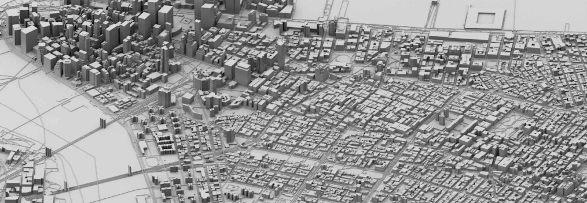
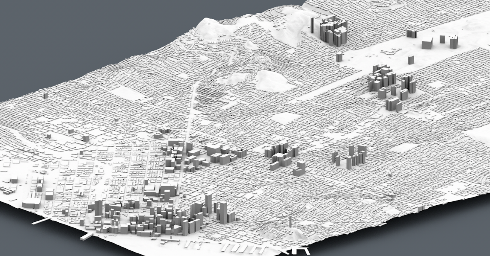

# vectiler

[](https://travis-ci.org/karimnaaji/vectiler)

A wavefront obj vector tile builder and exporter based on [mapzen](https://mapzen.com) [vector tiles](https://mapzen.com/projects/vector-tiles).

- build and export mesh in obj files based on tile coordinates (find your tiles of interest [here](http://www.maptiler.org/google-maps-coordinates-tile-bounds-projection/))
- bake ambiant occlusion and save it in an atlas (using [aobaker](https://github.com/prideout/aobaker))



**export example**

- https://sketchfab.com/models/e7ee1c0047ce4b5dbc768adcf7a7264e
- https://sketchfab.com/models/693df3f9180942fba3f865e0d5ddc0ce

**fetch submodules**

First initialize submodules by running:
```sh
$ git submodule update --init --recursive
```

**install dependencies (OS X)**

aobaker needs [embree](https://embree.github.io/) for optimal ray tracing and tbb, you can install it using [homebrew](http://brew.sh/):

```sh
$ cp 3rdparty/aobaker/embree.rb /usr/local/Library/Formula
$ brew install embree tbb cmake
```

**install dependencies (Linux)**

Linux port doesn't currently use aobaker.
To build vectiler you will need a compiler that supports `c++11`, for example with `g++-4.9` on an ubuntu machine:

```
$ sudo add-apt-repository ppa:ubuntu-toolchain-r/test
$ sudo apt-get update
# install curl/g++/cmake
$ sudo apt-get install g++-4.9 cmake libcurl4-openssl-dev
```

**build**

To build with cmake in a `build/` directory run the following:
```sh
$ cmake . -Bbuild
$ cmake --build build
```

**usage**

```
  Usage: ./vectiler.out [options]

  Options:
    --name                     File name ((null))
    --apikey                   Developer API key (https://mapzen.com/developers/) (vector-tiles-qVaBcRA)
    --splitMeshes              Generate one mesh per feature in wavefront file (0)
    --tilex                    Tile X (can be a tile range: 19294/19295) (19294)
    --tiley                    Tile Y (can be a tile range: 24642/24643) (24642)
    --tilez                    Tile Z (zoom) (16)
    --offsetx                  Global tile Offset on X coordinate (0.0)
    --offsety                  Global tile Offset on Y coordinate (0.0)
    --append                   Append the obj to an existing obj file (0)
    --buildings                Whether to export building geometry (1)
    --buildingsExtrusionScale  Building height scale factor (1.0)
    --terrain                  Generate terrain elevation topography (0)
    --terrainSubdivision       Terrain mesh subdivision (64)
    --terrainExtrusionScale    Terrain mesh extrusion scale (1.0)
    --aoBaking                 Generate ambiant occlusion baked atlas (0)
    --aoAtlasSize              Controls resolution of atlas (512)
    --aoSamples                Number of samples for ambient occlusion (256)
    --roads                    Whether to export roads geometry (0)
    --roadsHeight              The roads height offset (z-axis) (1.0)
    --roadsExtrusionWidth      The roads extrusion width (5.0)
    --normals                  Export with normals (1)
    --version                  Output version
    --help                     Output help
```

**terrain**

Terrain export is an experimental feature (data is only available in California).

```sh
$ ./vectiler --tilex 5242/5260 --tiley 12642/12666 --tilez 15 --terrain 1 --buildings 1 --terrainExtrusionScale 1.5 --buildingsExtrusionScale 1.9
```


**buildings**

Download one tile with ambiant occlusion baked in a texture:
```sh
$ ./vectiler --tilex 19294 --tiley 24642 --tilez 16 --sizehint 512 --nsamples 128
```


Output files are:
- `[tilex].[tiley].[tilez].obj`: a simple mesh containing coordinates and normals
- `[tilex].[tiley].[tilez]-ao.obj`: a mesh containing coordinates and texture uvs for ambiant occlusion rendering
- `[tilex].[tiley].[tilez].png`: an atlas containing the baked ambiant occlusion

Download a _big_ tile, in a file named `manhattan.obj` from a shell script:
```sh
$ ./vectiler --name manhattan --tilex 19293/19298 --tiley 24639/24643
```
